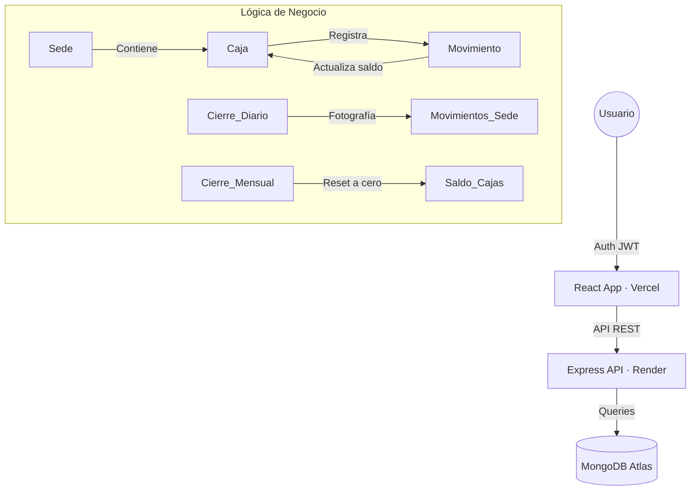

# 🏦 Sistema de Caja Premium — Estudio Jurídico Contable El Asesor SAC


> **Solución Corporativa de Alto Nivel** para la gestión financiera centralizada. Un ecosistema MERN diseñado para el control total de movimientos, auditoría regional y reportes de cumplimiento contable con una estética **Sober & Premium**.

---

## 💎 Experiencia de Usuario & Diseño
El sistema ha sido refinado bajo estándares de **Diseño Soberbio**, priorizando la legibilidad y la identidad corporativa:
- **Tipografía Unificada:** Uso de **Outfit** para encabezados de alto impacto y **Inter** para lectura técnica, garantizando concordancia visual en todo el proyecto.
- **Identidad Midnight & Cobalt:** Paleta de colores formal (Azul Marino Profundo y Cobalto Vibrante) con acentos en rojo pastel para alertas críticas.
- **Micro-animaciones:** Transiciones fluidas y efectos de hover dinámicos en tarjetas y botones.

---

## ✨ Características de Última Generación

| Módulo | Innovación & Funcionalidad |
|---|---|
| 📊 **Dashboard Analítico** | Visualización en tiempo real con **Recharts**. Incluye distribución de capital agrupada por tipo de cuenta y volumen operativo diario. |
| 🌍 **Control Regional** | Tarjetas de **Estado de Sede** con desglose de capital disponible por ubicación (Abancay, Challhuahuacho, etc.). |
| 📅 **Calendario Global** | Sistema de auditoría mediante calendario dinámico que permite consultar estados financieros de cualquier fecha pasada. |
| 🛡️ **Seguridad Multinivel** | Roles diferenciados (Admin/Cajero) con visibilidad segmentada. Los cajeros solo ven su sede; los admins auditan la corporación completa. |
| 💰 **Lógica de Saldos** | Cálculo dinámico de balances netos (Ingresos - Egresos) con validación automática de saldos mínimos y alertas de liquidez. |
| 📑 **Reportes Pro** | Generación de **PDFs Maestro** con membrete oficial y exportación a **Excel** con formato contable profesional. |
| ⚡ **Automatización** | Sistema de **Cierre Diario Automático** a las 23:59 y protocolo de Cierre Mensual para reinicio de cuentas. |

---

## 🛠️ Stack Tecnológico Premium

| Capa | Tecnología | Rol en el Proyecto |
|---|---|---|
| **Frontend** | React 19 + Vite | Interfaz ultra-rápida y reactiva. |
| **Backend** | Node.js + Express | API REST robusta con arquitectura controladora. |
| **Base de Datos** | MongoDB Atlas | Almacenamiento NoSQL escalable y seguro. |
| **Estilos** | Tailwind CSS 4 | Diseño atómico y responsivo. |
| **Visualización** | Recharts | Gráficos financieros dinámicos y tooltip interactivos. |
| **Documentación** | jsPDF + ExcelJS | Generación de documentos listos para impresión y auditoría. |

---

## 🏗️ Arquitectura de Datos



---

## ⚙️ Instalación y Configuración

### Requisitos
- **Node.js v18+**
- **MongoDB Atlas**
- **Token API RUC** (Para validación automática de facturas)

### 1. Preparación
```bash
git clone <repo-url>
cd Caja
```

### 2. Backend Setup
```bash
cd backend
npm install
```
Configurar `backend/.env`:
```env
MONGODB_URI=tu_uri_mongodb
JWT_SECRET=tu_clave_secreta
PORT=5000
```

### 3. Frontend Setup
```bash
cd frontend
npm install
```
Configurar `frontend/.env`:
```env
VITE_API_URL=http://localhost:5000/api
VITE_API_RUC_TOKEN=tu_token_api_peru
```

---

## ⚖️ Roles y Permisos Segmentados

- **ADMINISTRADOR:**
  - Panel de Operaciones Global.
  - Gestión de Infraestructura (Sedes, Cajas).
  - Auditoría de Personal y Movimientos.
  - Reportes Consolidados.
- **CAJERO_SEDE:**
  - Registro de Movimientos de su sede asignada.
  - Visualización de saldo local.
  - Generación de comprobantes y cierres de turno.

---

## ⚠️ Notas Técnicas de Mantenimiento

- **Zonas Horarias:** El sistema utiliza una lógica de fecha estandarizada `YYYY-MM-DD` para evitar discrepancias entre el servidor y el cliente en la generación de reportes.
- **Integridad de Datos:** No se recomienda la eliminación directa de movimientos en la base de datos; utilice siempre el sistema de auditoría del Admin Dashboard.
- **Modo Oscuro:** Implementado mediante variables CSS nativas y `View Transitions API` para una transición cinematográfica.

---

## 📜 Licencia
Uso privado y exclusivo para **Estudio Jurídico Contable El Asesor SAC**.

---
*Desarrollado con precisión técnica y estética corporativa — 2026*
