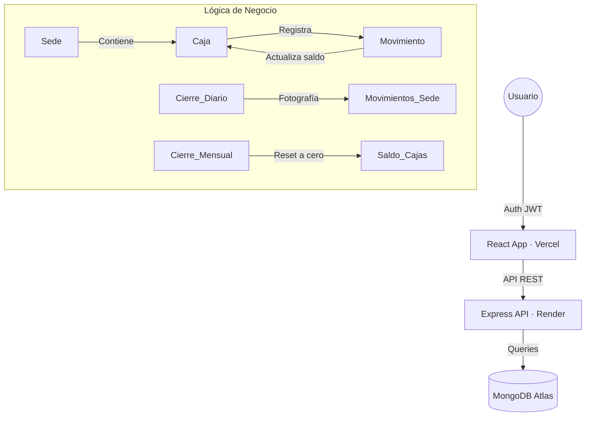

# 🏦 Sistema de Caja — Estudio Jurídico Contable El Asesor SAC


[](https://www.react.doctor/share?p=frontend&s=87&w=174&f=6)

> Sistema full-stack MERN para la gestión centralizada de cajas, movimientos financieros, cierres contables y auditoría por sedes. Diseñado con estética **Midnight & Cobalt** para uso corporativo formal.

---

## ✨ Características Principales

| Módulo | Descripción |
|---|---|
| 🔐 **Autenticación JWT** | Login con feedback de error detallado (contraseña incorrecta, usuario deshabilitado, etc.) |
| 📊 **Dashboard Analítico** | Gráficos de distribución por caja y sede con Recharts + calendario de actividad diaria |
| 💸 **Movimientos** | Registro de ingresos/egresos con validación SUNAT de comprobantes (Factura/Recibo) |
| 🔒 **Cierres de Caja** | Cierre diario (fotografía contable) y mensual (reset a cero con egreso automático) |
| 👤 **Gestión Admin** | CRUD completo de Usuarios, Sedes, Cajas y aprobación de movimientos pendientes |
| 🌙 **Modo Oscuro** | Transición animada con View Transitions API (efecto círculo expansivo) |
| 📄 **Reportes PDF** | Generación de actas de cierre y reportes financieros con jsPDF |

---

## 🛠️ Stack Tecnológico

| Capa | Tecnología | Versión |
|---|---|---|
| **Frontend** | React + Vite | 19.x / 8.x |
| **Backend** | Node.js + Express | 18+ / 5.x |
| **Base de Datos** | MongoDB + Mongoose | Atlas |
| **Estilos** | Tailwind CSS + CSS Variables | 4.x |
| **Notificaciones** | react-hot-toast | 2.x |
| **Gráficos** | Recharts | 3.x |
| **Reportes** | jsPDF + AutoTable | 4.x |
| **Deploy** | Vercel (frontend) + Render (backend) | — |

---

## 🏗️ Arquitectura del Sistema



---

## 📁 Estructura del Proyecto

```
Caja/
├── backend/
│   ├── controllers/      # auth, movimientos, cierres, usuarios, sedes, cajas
│   ├── middleware/        # verifyToken (JWT guard)
│   ├── models/            # Esquemas Mongoose (Usuario, Sede, Caja, Movimiento, Cierre)
│   ├── routes/            # Rutas API protegidas
│   └── server.js          # Entry point + conexión MongoDB
│
└── frontend/
    └── src/
        ├── api/           # Instancia Axios + interceptores JWT
        ├── context/       # AuthContext, ThemeContext (dark mode)
        ├── components/    # SidebarLayout, ThemeToggler, Loader, PerfilModal
        └── pages/         # Login, Dashboard, Movimientos, Cierres, AdminDashboard
```

---

## ⚙️ Instalación y Configuración

### Requisitos
- Node.js v18+
- MongoDB Atlas (o instancia local)

### 1. Clonar el repositorio

```bash
git clone <repo-url>
cd Caja
```

### 2. Configurar el Backend

```bash
cd backend
npm install
```

Crear `backend/.env`:

```env
MONGODB_URI=mongodb+srv://<usuario>:<password>@cluster.mongodb.net/caja
JWT_SECRET=tu_clave_secreta_aqui
PORT=5000
```

```bash
npm run dev
```

### 3. Configurar el Frontend

```bash
cd frontend
npm install
```

Crear `frontend/.env`:

```env
VITE_API_URL=http://localhost:5000/api
```

```bash
npm run dev
```

La aplicación estará disponible en `http://localhost:5173`.

---

## ⚖️ Roles y Permisos

| Rol | Acceso |
|---|---|
| **ADMINISTRADOR** | Dashboard global · CRUD de Sedes, Cajas y Usuarios · Aprobación de movimientos · Reportes maestros |
| **CAJERO_SEDE** | Solo su sede · Registro de movimientos · Historial propio · Cierres diarios y mensuales |

---

## 📋 Validaciones de Comprobantes (SUNAT)

| Tipo | Formato Serie | Campos requeridos |
|---|---|---|
| **Factura** | `F001-000001` | Nº correlativo + RUC (11 dígitos) + Razón Social |
| **Recibo** | `A0001` (letra + números) | Solo Nº correlativo |
| **Sin Sustento** | — | Ninguno |

El RUC es validado en tiempo real contra el patrón SUNAT: debe comenzar con `10`, `15`, `17` o `20`.

---

## 🚀 Deploy en Vercel

El archivo `vercel.json` en la raíz del frontend configura el rewrite para SPA:

```json
{
  "rewrites": [{ "source": "/(.*)", "destination": "/index.html" }]
}
```

Esto previene el error `404 NOT_FOUND` al refrescar rutas internas como `/dashboard` o `/admin`.

---

## ⚠️ Notas Técnicas

- **Transacciones atómicas:** Los movimientos usan `mongoose session`. Si modificas esa lógica, mantén la transacción para evitar saldos huérfanos.
- **Cierres:** El cierre **diario** toma una fotografía contable sin alterar saldos. El cierre **mensual** genera egresos automáticos para resetear las cuentas a cero.
- **Seguridad:** El interceptor Axios detecta errores 401 y redirige al login, excepto en el endpoint `/auth/login` para no interferir con el feedback de credenciales inválidas.

---

## 📜 Licencia

Uso privado y exclusivo para **Estudio Jurídico Contable El Asesor SAC**.

---

*Desarrollado con ❤️ — Sistemas Distribuidos 2026*
