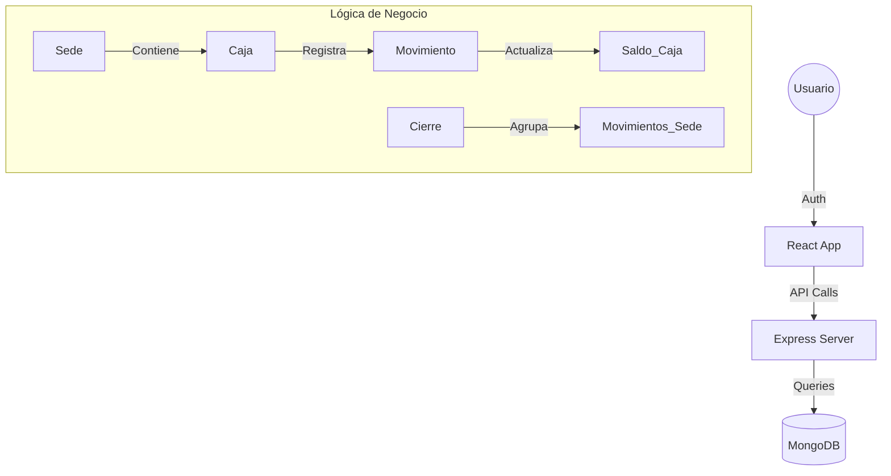

# 🏦 Caja — Sistema de Gestión de Caja Distribuida

¡Bienvenido al sistema de gestión financiera de **Estudio Contable El Asesor**! Este proyecto es una solución MERN full-stack diseñada para centralizar el control de ingresos y egresos de múltiples sedes, permitiendo un cierre de caja consolidado y generación de reportes profesionales.

---

## 🚀 Vista Rápida para Desarrolladores

Si acabas de llegar a este proyecto, aquí tienes lo esencial:
- **Core:** Arquitectura distribuida por Sedes. Los movimientos pertenecen a Cajas, las Cajas a Sedes, y el Cierre es **Global por Sede**.
- **Seguridad:** JWT en las cabeceras, contraseñas con `bcryptjs` y transacciones atómicas con Mongoose para evitar inconsistencias de saldo.
- **UI:** Diseñada con un enfoque corporativo "Midnight & Gray", usando Recharts para análisis visual y jsPDF para reportes offline.

---

## 🛠️ Tecnologías

| Capa | Tecnología | Propósito |
|---|---|---|
| **Frontend** | React 19 + Vite | Interfaz rápida y reactiva |
| **Backend** | Node.js + Express 5 | API REST robusta |
| **Base de Datos** | MongoDB + Mongoose | Almacenamiento NoSQL con esquemas |
| **Estilos** | Tailwind CSS 4 | Diseño premium y responsivo |
| **Reportes** | jsPDF + ExcelJS | Exportación de datos |
| **Gráficos** | Recharts | Visualización de saldos y flujos |

---

## 🏗️ Arquitectura del Sistema



---

## 📁 Estructura del Proyecto

```text
Caja/
├── backend/
│   ├── controllers/      # Lógica: Cierres, Movimientos, Reportes (Excel), Comprobantes
│   ├── models/           # Esquemas: Usuario, Sede, Caja, Movimiento, Cierre, Periodo
│   ├── routes/           # Definición de rutas protegidas
│   ├── middlewares/      # auth.middleware.js (Control de JWT y Roles)
│   └── server.js         # Punto de entrada y conexión DB
└── frontend/
    └── src/
        ├── api/          # Configuración de Axios
        ├── context/      # AuthContext y ThemeContext (Estado global)
        ├── pages/        # Vistas principales (Dashboard, Admin, Cierres)
        └── components/   # UI Reutilizable (Layout, Modales, Gráficos)
```

---

## ⚙️ Instalación y Configuración

### 1. Requisitos previos
- Node.js (v18+)
- MongoDB Atlas o Local

### 2. Clonar e Instalar
```bash
git clone <repo-url>
cd Caja

# Backend
cd backend && npm install

# Frontend
cd ../frontend && npm install
```

### 3. Variables de Entorno (.env)
En `backend/.env`:
```env
MONGO_URI=tu_cadena_de_conexion
JWT_SECRET=tu_clave_secreta_pro
PORT=5000
```

### 4. Ejecución
- **Backend:** `npm run dev` (usando `--watch`)
- **Frontend:** `npm run dev` (Vite)

---

## ⚖️ Roles y Permisos

- **ADMINISTRADOR**:
    - Acceso total a todas las sedes.
    - CRUD de Sedes, Cajas y Usuarios.
    - Reportes globales.
- **CAJERO_SEDE**:
    - Restringido a su propia sede (`id_sede`).
    - Registrar movimientos.
    - Realizar el Cierre de Caja Global (Daily/Monthly).

---

## 📋 Guía para Mejora (Roadmap)

Si quieres mejorar este sistema, aquí hay algunas áreas clave identificadas:

### 1. Pruebas (Testing)
- **Backend:** Implementar Jest + Supertest para validar los controladores de `movimiento` y `cierre`.
- **Frontend:** Pruebas de componentes con Vitest.

### 2. Funcionalidades Pendientes
- [ ] **Módulo de Auditoría**: Logs de quién editó qué usuario o sede.
- [ ] **Notificaciones**: Avisos cuando una caja baja del `saldo_minimo`.
- [ ] **Facturación**: Integración (mock) con sistemas de facturación electrónica.
- [ ] **Exportación mejorada**: Filtros avanzados en Excel (rango de fechas, tipo de concepto).

### 3. Optimización
- [ ] Implementar **Redis** para caching de los totales del Dashboard si el volumen de datos crece.
- [ ] Migrar a **TypeScript** para mayor seguridad en el tipado de la API y los modelos.

---

## ⚠️ Notas Técnicas Importantes

- **Consistencia de Datos:** Los movimientos usan transacciones de Mongoose. Si planeas modificar la lógica de `movimiento.controller.js`, asegúrate de mantener la sesión (`session`) para evitar saldos huérfanos.
- **Cierres de Caja:** El sistema calcula el `saldo_esperado` sumando los movimientos desde el último cierre. Si se editan movimientos antiguos, el cierre histórico podría verse afectado (se recomienda bloquear edición de movimientos cerrados).
- **Timezones:** Se recomienda manejar todas las fechas en UTC en el backend y convertirlas en el frontend para evitar discrepancias en los reportes PDF.

---

## 📜 Licencia
Este proyecto es privado para el **Estudio Contable El Asesor**.

---
*Desarrollado con ❤️ para la eficiencia financiera.*
