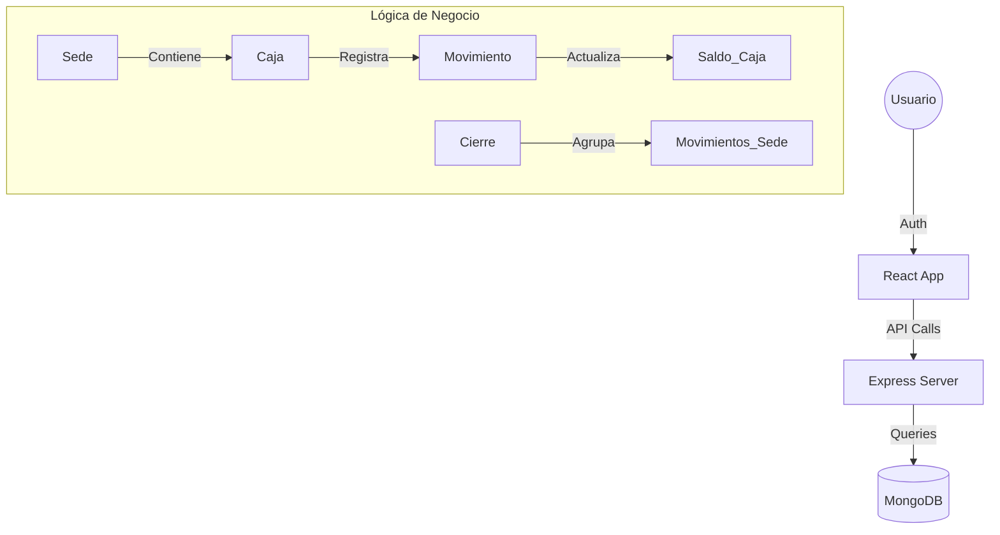

# 🏦 Corporación Interoceánica JJJA S.R.L. — Sistema de Gestión de Cajas


¡Bienvenido al sistema financiero y de control de cajas de **Corporación Interoceánica JJJA S.R.L.**! Este proyecto es una solución MERN full-stack diseñada bajo estrictos estándares de UI/UX, orientada a centralizar el control de ingresos y egresos de múltiples sedes, permitiendo auditorías rigurosas, cierres de caja consolidados y generación de reportes profesionales.

---

## 🚀 Vista Rápida para Desarrolladores

- **Core:** Arquitectura distribuida por Sedes. Los movimientos pertenecen a Cajas, las Cajas a Sedes, y el Cierre es **Global por Sede**.
- **Seguridad:** JWT en las cabeceras, contraseñas encriptadas con `bcryptjs` y transacciones atómicas con Mongoose para evitar inconsistencias de saldo.
- **UX/UI:** Interfaz "Midnight & Gray" con *Glassmorphism*. Incluye modales interactivos para confirmaciones destructivas y Recharts para análisis visual.
- **Auditoría:** Los cierres mensuales realizan un arqueo y retiro automático de fondos para mantener un historial limpio ("Reset a Cero").

---

## 🛠️ Tecnologías

| Capa | Tecnología | Propósito |
|---|---|---|
| **Frontend** | React 19 + Vite | Interfaz rápida, reactiva y modular |
| **Backend** | Node.js + Express 5 | API REST robusta y asíncrona |
| **Base de Datos** | MongoDB + Mongoose | Almacenamiento NoSQL con validación de esquemas |
| **Estilos** | Tailwind CSS 4 | Diseño premium, *Dark Mode* nativo y responsivo |
| **Reportes** | jsPDF + ExcelJS | Exportación de datos financieros y actas |

---

## 🏗️ Arquitectura del Sistema



---

## 📁 Estructura del Proyecto

```text
Caja/
├── backend/
│   ├── controllers/      # Lógica: Cierres, Movimientos, Autenticación, Usuarios
│   ├── models/           # Esquemas (Mongoose)
│   ├── routes/           # Rutas protegidas
│   └── server.js         # Punto de entrada y conexión a MongoDB
└── frontend/
    └── src/
        ├── api/          # Interceptores Axios
        ├── context/      # Estados globales (AuthContext, ThemeContext)
        ├── pages/        # Vistas principales (Dashboard, Movimientos, Cierres)
        └── components/   # UI Reutilizable (Modales, TopBar, Sidebar)
```

---

## ⚙️ Instalación y Configuración

### 1. Requisitos previos
- Node.js (v18+)
- MongoDB Atlas o Local

### 2. Clonar e Instalar
```bash
git clone <repo-url>
cd Caja

# Backend
cd backend && npm install

# Frontend
cd ../frontend && npm install
```

Para instrucciones detalladas de cada entorno, consulta:
- [Guía del Frontend](./frontend/README.md)
- [Guía del Backend](./backend/README.md)

---

## ⚖️ Roles y Permisos

- **ADMINISTRADOR**: Acceso total al sistema. CRUD completo de Sedes, Cajas y Usuarios. Auditoría global de cierres y reportes maestros.
- **CAJERO_SEDE**: Restringido a su propia sede física. Puede registrar movimientos operativos, consultar su historial y ejecutar los Cierres de Caja (Diario/Mensual).

---

## ⚠️ Notas Técnicas Importantes

- **Consistencia de Datos:** Los movimientos usan transacciones de Mongoose (`session`). Si modificas la lógica, mantén la transacción para evitar saldos huérfanos.
- **Lógica de Cierres:** Un **Cierre Diario** toma una fotografía contable pero no altera el saldo. Un **Cierre Mensual** genera automáticamente "Egresos" para vaciar las cuentas a cero y empezar un nuevo periodo limpio.

---

## 📜 Licencia
Este código fuente es de uso privado y exclusivo para **Corporación Interoceánica JJJA S.R.L.**

---
*Diseñado y desarrollado con ❤️ enfocados en la excelencia operativa.*
